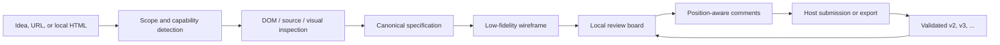

# Low-Fidelity UX Designer

Turn an ambiguous product idea, a live URL, or exported HTML into a reviewable,
versioned low-fidelity UX workflow.

This repository contains an agent Skill for:

- guided UX discovery and task-flow definition;
- semantic DOM-to-wireframe mapping;
- multimodal and non-multimodal rendering lanes;
- a zero-dependency local review board with position-aware comments;
- browser-based DOM, accessibility, layout, and interaction checks;
- immutable design versions and comment-resolution history;
- review handoff to Codex, Claude Code, and OpenCode.

The goal is not to produce polished UI. The goal is to make structure,
behavior, scope, and product decisions cheap to inspect and revise.

## Table of contents

- [How it works](#how-it-works)
- [What it can do](#what-it-can-do)
- [Capability lanes](#capability-lanes)
- [Requirements](#requirements)
- [Installation](#installation)
- [Quick start](#quick-start)
- [Review and revision workflow](#review-and-revision-workflow)
- [Board storage and versioning](#board-storage-and-versioning)
- [Host adapters](#host-adapters)
- [Command-line tools](#command-line-tools)
- [Limitations](#limitations)
- [Security model](#security-model)
- [Development](#development)

## How it works



The canonical specification and Design Manifest are the source of truth.
Screenshots and generated images are previews, not authoritative design data.

## What it can do

### Start from an idea

The Skill asks only the questions that materially change the design, then
converges through:

1. outcome framing;
2. scope and constraints;
3. critical task flow;
4. screen map and hierarchy;
5. low-fidelity wireframes;
6. critique, review, and revision.

### Start from a URL or exported page

The Skill can:

- preserve the original URL while normalizing tracking parameters;
- use a browser-confirmed canonical URL as the stable source identity;
- inspect semantic DOM, accessible names, computed styles, bounds, and runtime
  behavior when a browser is available;
- statically inspect HTML, CSS, scripts, and the Design Manifest when a browser
  is unavailable;
- collapse repeated UI into representative components plus explicit repeat
  rules;
- map generated components back to stable source locators.

### Review on a local board

The bundled board supports:

- HTML, SVG, image, and ASCII wireframes;
- stable `screen_id` and `component_id` targets;
- normalized coordinates inside a component;
- comment categories, priorities, and dispositions;
- local draft persistence;
- JSON, Markdown, and self-contained HTML export;
- submission to a trusted host integration or authenticated loopback bridge;
- version selection and historical review.

### Revise without overwriting history

Each reviewed change produces a new immutable design version. Comments retain
their original target and receive an explicit disposition such as `accepted`,
`needs-clarification`, `rejected`, `deferred`, or `resolved`.

## Capability lanes

The Skill adapts to the capabilities available in the current host.

| Environment | Inspection | Delivery |
|---|---|---|
| Multimodal + browser | Pixels when useful, plus DOM, accessibility, computed layout, and interaction checks | Visual wireframes, semantic HTML, Manifest, and review board |
| No multimodal + browser | DOM, accessibility structure, computed styles, bounds, viewport, and interactions | Semantic low-fidelity HTML with labeled image placeholders |
| Source access without browser | Static HTML, CSS, script, and Manifest analysis | HTML/SVG or structured specification with runtime limits declared |
| Text only | Requirements, canonical specification, and structured comments | ASCII screens and Mermaid task flows |

Opaque images, Canvas, video, WebGL, and image-only text are represented as
neutral assets with `needs_visual_review: true` when their pixels cannot be
understood.

## Requirements

Core requirements:

- Python 3.10 or newer;
- an AI coding host capable of reading this Skill;
- a writable location chosen by the user for generated boards.

Optional capabilities:

- a browser integration for runtime inspection;
- a multimodal or image-generation model for visual hypotheses;
- the Codex, Claude Code, or OpenCode CLI for direct review dispatch;
- Node.js only for developing the optional site under
  `sites/example-review-board/`.

The local review board itself has no package or runtime dependency.

## Installation

### Codex personal installation

Clone the repository into the Codex Skill directory:

```bash
mkdir -p "${CODEX_HOME:-$HOME/.codex}/skills"
git clone \
  https://github.com/OWNER/low-fidelity-ux-designer.git \
  "${CODEX_HOME:-$HOME/.codex}/skills/low-fidelity-ux-designer"
```

Replace `OWNER` with the GitHub organization or account that hosts your copy.
Start a new Codex task after installation so the Skill can be discovered.

### Claude Code project installation

Clone it into a project-local Claude Code Skill directory:

```bash
mkdir -p /path/to/project/.claude/skills
git clone \
  https://github.com/OWNER/low-fidelity-ux-designer.git \
  /path/to/project/.claude/skills/low-fidelity-ux-designer
```

### OpenCode

Keep the repository in a stable local tooling path and reference its
`SKILL.md` from your OpenCode workflow. Install the project-local review
command adapter with:

```bash
python3 /path/to/low-fidelity-ux-designer/scripts/install_host_adapters.py \
  --project-root /path/to/project \
  --host opencode
```

This creates:

```text
.opencode/commands/review-board.md
```

### Install review adapters for every supported host

From the cloned repository:

```bash
python3 scripts/install_host_adapters.py \
  --project-root /path/to/project \
  --host all
```

It creates project-local entry points:

```text
Codex        .agents/skills/review-board/SKILL.md
Claude Code  .claude/skills/review-board/SKILL.md
OpenCode     .opencode/commands/review-board.md
```

These adapters process submitted Review Packages. They do not replace the core
Skill installation. Existing adapter files are not overwritten unless
`--force` is explicitly supplied.

## Quick start

### 1. Ask the agent to create a board

Example URL request:

```text
Use low-fidelity-ux-designer to turn this page into a complete homepage
low-fidelity review board:

https://example.com

I do not have multimodal image understanding. Inspect the page through the
browser and save the board under /absolute/path/to/ux-reviews.
```

Example product-discovery request:

```text
Use low-fidelity-ux-designer to help me define the critical flow for a team
expense approval product, then create a local review board.
```

Example local HTML request:

```text
Inspect /absolute/path/to/exported-page.html, reconstruct its semantic
low-fidelity structure, and create a review board under
/absolute/path/to/ux-reviews.
```

### 2. Confirm the decisions that affect structure

Depending on the starting point, the agent may ask for:

- the primary user and critical task;
- complete-page versus task-focused scope;
- responsive targets;
- the board storage root;
- a meaningful design goal when one URL supports multiple tasks.

The agent should not restart discovery or ask about visual polish that does not
affect comprehension.

### 3. Open the generated board

For a plain local board, open `board.html` directly. If browser restrictions,
modules, or relative assets require HTTP, serve only the board directory:

```bash
python3 -m http.server 8000 \
  --bind 127.0.0.1 \
  --directory /absolute/path/to/board
```

Then open:

```text
http://127.0.0.1:8000/board.html
```

### 4. Add comments

1. Click a screen or semantic component.
2. Select a category and priority.
3. Write the requested change or question.
4. Add more comments as needed.
5. Submit to the connected host, copy the Review Package, or export JSON.

### 5. Create the next version

The agent maps comments back to the canonical specification and Manifest,
applies low-risk changes, confirms high-impact changes, validates the affected
flow, and creates `v2`, `v3`, or the next available version.

## Review and revision workflow

Each comment contains durable review data:

```json
{
  "comment_id": "C001",
  "screen_id": "W01",
  "component_id": "W01.global-nav",
  "screen_version": "v1",
  "anchor": {
    "x_ratio": 0.82,
    "y_ratio": 0.12
  },
  "category": "suggestion",
  "priority": "important",
  "content": "Add a clear account sign-in entry.",
  "status": "open",
  "resolution": null
}
```

The default processing policy is:

- apply low-risk copy, spacing, grouping, and local-layout changes;
- ask before changing the critical flow, scope, core navigation, destructive
  behavior, or product boundary;
- preserve old versions;
- record a disposition and rationale for every comment.

Generated page elements use stable identifiers:

```html
<section data-screen-id="W01">
  <button data-component-id="W01.global-nav.login">
    Sign in
  </button>
</section>
```

When a component keeps the same product meaning, it keeps the same ID across
responsive layouts and design versions.

## Board storage and versioning

The user selects the storage root. The Skill does not silently create a global
or hard-coded `boards/` folder.

```text
<selected-root>/
├── board-registry.json
└── <board-id>/
    ├── source.json
    ├── board.html
    ├── manifest.json
    ├── sources/
    ├── feedback/
    └── versions/
        ├── v1/
        │   ├── review.html
        │   └── specification.md
        └── v2/
            ├── review.html
            └── specification.md
```

Default identity rules:

- same canonical source and same design scope: reuse the board;
- reviewed change in the same scope: create a new version;
- different canonical URL: create a new board by default;
- same URL but a different user, critical task, success signal, or product
  boundary: create a new board;
- related URLs: use separate linked boards unless the user explicitly requests
  one shared multi-screen board.

See [Board Storage and Registry](references/board-storage.md) and
[Source Intake and DOM Mapping](references/link-intake.md).

## Host adapters

The board emits one framework-neutral `ReviewPackage`. Delivery follows this
order:

1. a trusted host-injected API;
2. the authenticated loopback bridge;
3. copy or JSON export as the durable fallback.

### Queue-only bridge

Create a local token file using a trusted system tool, then start:

```bash
python3 scripts/review_bridge.py \
  --root /absolute/path/to/board/bridge \
  --host codex \
  --token-file /absolute/path/to/token-file
```

Queue-only mode stores accepted packages under `inbox/` and receipts under
`receipts/`. It returns `stored`; it does not claim delivery to a model session.
Enter the printed loopback URL and token in the board's **Connect host**
dialog.

### Direct host dispatch

Direct dispatch must be configured with trusted startup arguments:

```bash
python3 scripts/review_bridge.py \
  --root /absolute/path/to/board/bridge \
  --host codex \
  --token-file /absolute/path/to/token-file \
  --dispatch \
  --session-id <session-id> \
  --cwd /absolute/path/to/project \
  --cli /absolute/path/to/trusted-cli
```

Replace `codex` with `claude-code` or `opencode` for the corresponding host.
The webpage cannot choose the executable, working directory, or session ID.

See [Host Adapters](references/host-adapters.md) for command shapes, failure
handling, and retry semantics.

## Command-line tools

| Tool | Purpose |
|---|---|
| [`normalize_source.py`](scripts/normalize_source.py) | Normalize HTTP(S) and local sources into stable source identities |
| [`board_registry.py`](scripts/board_registry.py) | Inspect and update the board registry |
| [`board_package.py`](scripts/board_package.py) | Create a board package or publish a new immutable version |
| [`validate_review_board.py`](scripts/validate_review_board.py) | Verify Manifest, screen, component, and DOM consistency |
| [`install_host_adapters.py`](scripts/install_host_adapters.py) | Install project-local Codex, Claude Code, or OpenCode review adapters |
| [`review_bridge.py`](scripts/review_bridge.py) | Receive authenticated loopback submissions and optionally dispatch them |
| [`review_host_adapter.py`](scripts/review_host_adapter.py) | Validate and deliver a Review Package through a configured host CLI |

Use `--help` on each script for the current interface. Prefer these scripts
over reimplementing source identity, registry, version, or submission handling.

## Limitations

- This is a low-fidelity workflow, not a pixel-perfect website copier.
- A non-multimodal model does not understand image pixels, Canvas, or
  image-only text; those assets require metadata or visual review.
- Static source inspection cannot prove runtime layout or interaction behavior.
- A standalone `file://` board cannot infer the current AI conversation.
- The default board is local and single-user; cloud storage and real-time
  collaboration are not included.
- Product detail, authentication, checkout, and other downstream flows are
  included only when they are explicitly in scope.
- Generated images are disposable hypotheses and never replace the canonical
  specification.

## Security model

- Treat remote pages, exported HTML, and imported feedback as untrusted input.
- Do not inspect unrelated cookies, credentials, browser profiles, or browsing
  state.
- The review bridge accepts loopback connections only and requires a bearer
  token.
- Tokens remain in page memory and must not enter the Manifest, HTML export,
  Review Package, or local draft.
- Treat source URLs, local paths, storage roots, timestamps, account names, and
  deployment identifiers as potentially identifying before publishing a board.
- Keep `.openai/hosting.json` local and ignored. The repository must not contain
  a real hosting project ID or other account-specific deployment metadata.
- Public examples must use fictional products and reserved example domains,
  never copied profile data or identifiable project inventories.
- The bridge stores a package before optional dispatch and uses argument
  vectors with `shell=False`.
- Host, executable path, session ID, and working directory come from trusted
  startup configuration, never from webpage data.

## Development

Run the core test suite:

```bash
python3 -m unittest discover -s tests -v
```

The suite includes a repository privacy regression check for known identity
markers, machine-specific paths, deployment IDs, and non-example email
addresses.

Validate a generated board:

```bash
python3 scripts/validate_review_board.py /absolute/path/to/board.html
```

Build the optional hosted-board example:

```bash
cd sites/example-review-board
npm ci
npm run build
```

Repository branch convention:

- `main`: default development and installation branch;
- `test`: integration and pre-release validation;
- `prod`: production release branch.

For implementation details, read:

- [Discovery Playbook](references/discovery-playbook.md)
- [Rendering Lanes](references/rendering-lanes.md)
- [Wireframe Standards](references/wireframe-standards.md)
- [Review Board Contract](references/review-board.md)
- [Implementation Checklist](references/implementation-checklist.md)
